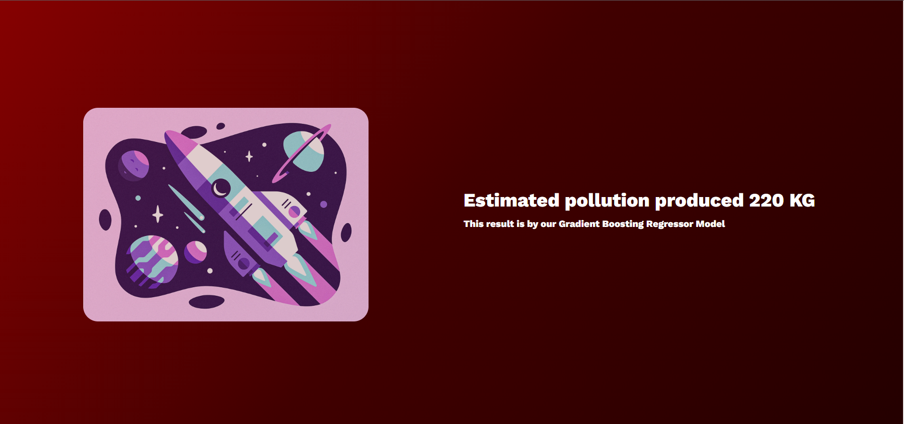

## replace your chat gpt api to access the all features. actually github banned my token api for some reason, so some features may not work properlly.
# RocketAirInsightX
Gaining Insight into Air Pollution and Rocket Performance with Gradient Boosting Regression.

# Description
The purpose of this program is to gather input data regarding rocket properties, such as maximum altitude, fuel type, fuel mass, and propellant mass. The resulting model calculates the amount of pollution emitted into the atmosphere during a rocket launch this gases includes Black CO2, Black Carbon, NOx, nClx, Stratospheric Alumina and Methane. As the space industry continues to expand, it is important to monitor the effects of these vehicles. By doing so, we can work towards using eco-friendly fuel and developing facilities that promote environmentally-conscious space exploration in the future.

# Features
  Amount of Emmited Pollution 
  Chat-GPT custom Suggestion for Rockets 

# Technologies Used
1. Python
2. Pandas
3. NumPy
4. Sklearn
5. Joblib
6. Flask
7. JavaScript
8. SCSS
9. CSS
10. Bootstrap
11. ChatGPT API
12. html

# Getting Started

1. Clone this repository                                                            
2. Install dependencies
pip install Pandas
pip install numPy
pip install sklearn
pip install joblib
pip install flask
pip install flask-cors
pip install Pandas

3. To run the project, start by running our API_index file. This file functions as a server for ML predictions and other functionalities. To do this, run the command "python API_index.py". If you encounter any errors related to Flask CORS, you can run the command "pip install flask-cors" to allow browser requests to  local machine. After starting the server, open the client-side folder and execute the index.html file, which serves as the user interface for our model. Our model is trained on a dataset, and we use it to determine the exact amount of pollution that can be released into the Earth's atmosphere by launching rockets. Additionally, we analyze the data provided by the user using our data and Chat-GPT API to provide more accurate and practical recommendations for reducing pollution caused by rocket launches.

Here are some Preview of our program in action:

Contributors
Mohsen Sajjadi, 
Negar Nezhadi, 
Farbod Khorramvatan, 
Parham Zahedi

Acknowledgments